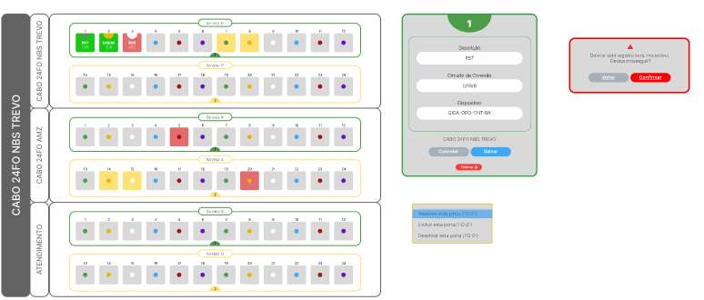

<h1 align="center"> PROJETO DGO </h1>

 (starting)

 
 

  

## 🚀 Tecnologias

Esse projeto por enquanto esta sendo desenvolvido com as seguintes tecnologias:

- HTML e CSS
- JavaScript
- Git e Github

## 💻 Projeto

Projeto DGO esta sendo desenvolvido para o gerenciamento de um distribuidor interno de fibras ópticas.

---
